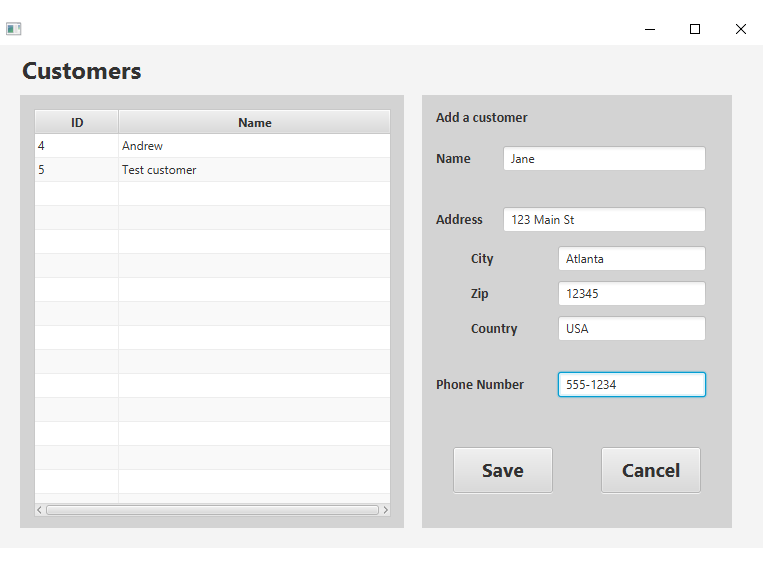

# JavaFX Appointment Scheduler Application

Developed using NetBeans 8.2

## PROJECT SCENARIO

"You are working for a software company that has been contracted to develop a scheduling desktop user interface application. 
The contract is with a global consulting organization that conducts business in multiple languages and has main offices in 
Phoenix, Arizona; New York, New York; and London, England. The consulting organization has provided a MySQL database that your 
application must pull data from. The database is used for other systems and therefore its structure cannot be modified."

## FEATURES

**A.**   Log-in form that can determine the user’s location and translate log-in and error control messages into **two languages**.

**B.**   Ability to add, update, and delete customer records in the database, including name, address, and phone number.

**C.**   Ability to add, update, and delete appointments, capturing the type of appointment and a link to the 
specific customer record in the database.

**D.**   Ability to view the calendar by month and by week.

**E.**    Ability to automatically adjust appointment times based on user **time zones and daylight savings time**.

**F.**   **Exception controls** to prevent each of the following:

    •   scheduling an appointment outside business hours

    •   scheduling overlapping appointments

    •   entering nonexistent or invalid customer data

    •   entering an incorrect username and password

**G.**  **Lambda expressions** to increase program efficiency

**H.**   Visual **alert** if there is an appointment within 15 minutes of the user’s log-in.

**I.**   Ability to generate each of the following **reports**:

    •   number of appointment types by month

    •   the schedule for each consultant

    •   one additional report of your choice

**J.**   Ability to track user activity by **recording timestamps for user log-ins** in a .txt file. 

## INSTRUCTIONS

1. Open the **C195Scheduler.jar** file in C195Scheduler\dist directory.

2. Enter Credentials:

    Username: **test**
    
    Password: **test**
    
3. Add/edit appointments and customers, view reports as desired.

## EXAMPLES

Code snippet showing method checking for upcoming appointment within 15 minutes of login

"Add appointment" screen showing date picker widget

"New customer" screen

Appointment schedule report for "test" user

